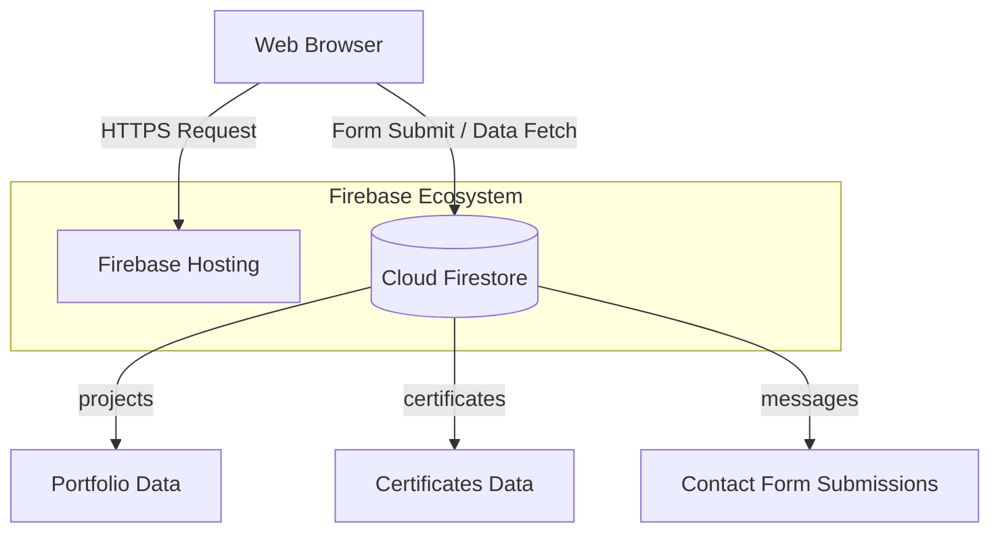

<div align="center">
  

  # NOB Rotana — Developer Portfolio

  **Software & Web App Builder**

  [](https://firebase.google.com/)
  [](https://html.com/)
  [](https://www.w3.org/Style/CSS/Overview.en.html)
  [](https://developer.mozilla.org/en-US/docs/Web/JavaScript)
  [](https://nobrotana.web.app)
</div>

---

## 📖 Overview

Welcome to the **NOB Rotana Developer Portfolio** repository! This project serves as my digital presence, showcasing my work, skills, and professional journey as a Software & Web App Builder.

- **Hosting:** [https://nobrotana.web.app](https://nobrotana.web.app) (Hosted on Firebase)

## ✨ Features

- **Latest Updates:** Added an **AI-Powered Development** section outlining workflow and use cases with AI tools. Updated Hero section to reflect "Software & Web App Builder" title. Integrated new major projects (**S Tech Store**, **Delight Fashion**, and **NRI Studio**), featuring full bilingual support and modern UI cards. Reorganized featured projects grid and updated media links.
- **Dynamic Content:** Optional Firestore collections `projects` and `certificates` dynamically replace static placeholders.
- **Interactive UI:** Responsive layout, dark/light theme, scroll effects, optional canvas weather + audio (user-triggered only).
- **Contact System:** Integrated contact form writes directly to Firestore collection `messages`.
- **Clean URLs:** Enabled `cleanUrls: true` for Firebase Hosting (e.g., paths like `/test` instead of `/test.html`).

## 🏗️ Architecture & Infrastructure



## 📂 Project Structure

```text
.
├── public/
│   ├── index.html      # Main portfolio (Firebase Hosting entry)
│   ├── script.js       # Client-side interactivity
│   ├── style.css       # Styles & Themes
│   ├── Assets/         # Media, Images, and Icons
│   └── …
├── firebase.json       # Hosting + Firestore rules configuration
├── firestore.rules     # Database Security Rules
├── .firebaserc         # Firebase project target
└── README.md
```

## 🚀 Getting Started

### Prerequisites

- [Node.js](https://nodejs.org/) (for `npx firebase-tools`)
- A [Firebase](https://console.firebase.google.com/) project with **Firestore** enabled

### Local Setup & Preview

1. Open `public/index.html` in a browser, or use any static server pointed at `public/`:
   ```bash
   npx serve public
   ```
2. *Note: Some Firestore calls require `http(s)` origins allowed in Firebase Console if testing from `file://`.*

## ⚙️ Firebase Configuration

1. In the Firebase Console, open your project → **Project settings** → **Your apps** → Web app config.
2. Ensure `public/index.html` uses the same **`projectId`** / config as `.firebaserc`.

> **Security Note:** The Web API key in `index.html` is standard for client apps. Access is strictly enforced by **`firestore.rules`**.

## 🚀 Deployment

Deploy from the repository root (where `firebase.json` lives):

```bash
# One-time login
firebase login

# Select project target
firebase use nobrotana

# Deploy Hosting + Firestore rules
firebase deploy --only firestore,hosting
```

Or using `npx`:
```bash
npx firebase-tools deploy --only firestore,hosting
```

## 🗄️ Firestore Data Model (Optional)

| Collection | Purpose | Rules/Notes |
|------------|---------|-------------|
| `messages` | Contact form | Created by visitors; rules allow **create** only |
| `projects` | Portfolio grid | Public **read**; managed via Console/Admin SDK |
| `certificates` | Certificates | Public **read**; managed via Console/Admin SDK |

**Example Documents:**
- `projects`: `title`, `description`, `tags` (array), `mediaType` (`image`\|`video`\|`iframe`), `imageUrl`, `githubUrl`, `liveUrl`.
- `certificates`: `issuer`, `title`, `date`, `icon`, `credentialUrl`, `previewImageUrl`.

## 🔄 Version Control

```bash
git add .
git commit -m "Describe your change"
git push origin main
```

---

<div align="center">
  <b>Author:</b> NOB Rotana<br>
  Portfolio repository: <a href="https://github.com/Rotananob/Nob_Rotana">Nob_Rotana</a>
</div>
